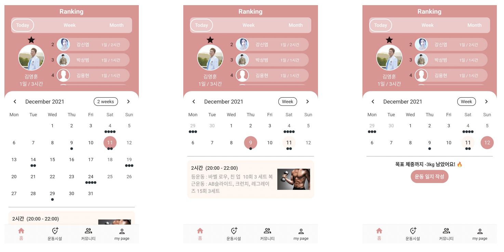

# 운동하자

 

## 👨🏻‍💻 built with
 

 

## 💡 Goal
* 지속적인 운동을 위한 동기부여 
* 함께 운동하는 분위기 조성 
* 운동 방법에 대해 정보 공유 

 

## 📱 Functions
* 친구들과 운동 시간으로 랭킹제공 기능
* 운동하는 사람들과 정보를 공유하는 게시판 제공
* 주변 헬스장 검색 기능
* 사용자의 신체 변화 그래프 제공 (체중/골격근/체지방량)

 

## 🔆 Expected effect
* 사용자의 운동량 증가로 인해 건강증진
* 공공데이터를 사용함으로써 헬스장 정보를 주기적 업데이트 가능
* 자신의 건강 체크 및 헬스장 검색을 하나의 어플로 할 수 있어 편의성 증대
* 커뮤니티 기능으로 인해 지역 주민 간 친밀도 증가

 

## 🎥 Demo
[https://youtu.be/MrGBiTEe9b4](https://youtu.be/MrGBiTEe9b4)  
